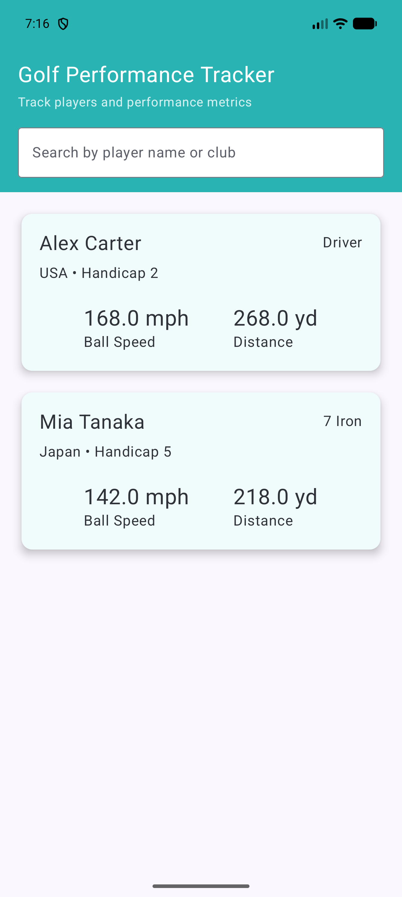
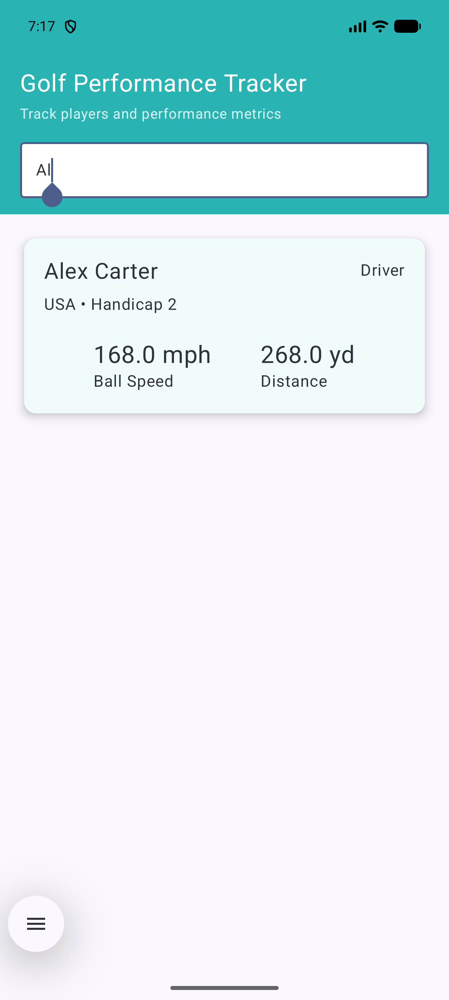
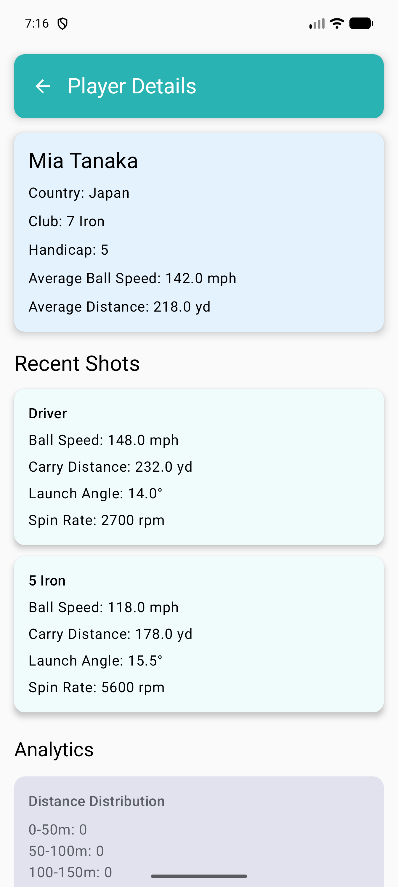
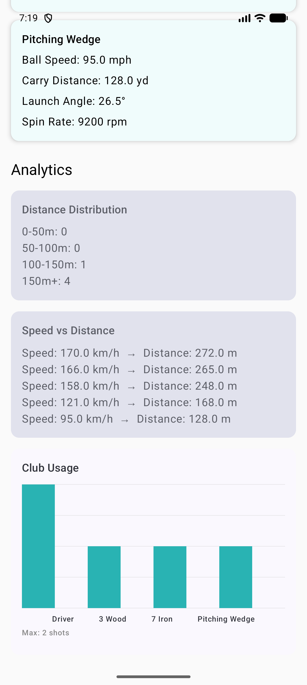
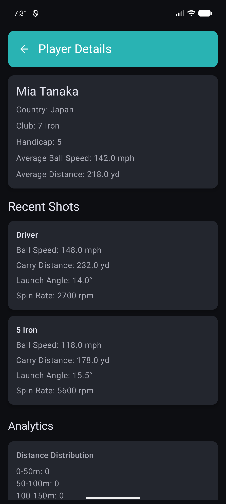
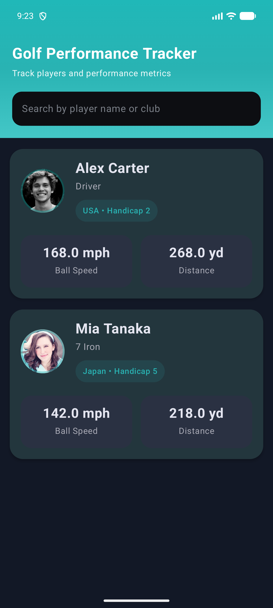

# Golf Performance Tracker ⛳

An Android application built as part of the Rapsodo Android Engineering Assignment.

---

# Overview

Golf Performance Tracker is a modern Android application that allows users to browse golf players, analyze performance metrics, review shot statistics, and access data even when offline.

The project demonstrates Android development best practices using modern Android technologies and architectural patterns.

---

# Features

## Player Management

### Players List

- View all golf players
- Search players by name, club, or country
- Display player avatars
- Display player performance metrics
- Modern card-based UI
- Responsive and user-friendly experience

### Player Information

Each player card displays:

- Profile Image
- Name
- Country
- Preferred Club
- Handicap
- Average Ball Speed
- Average Carry Distance

---

## Player Details

Detailed player profile screen containing:

### Profile Section

- Player Avatar
- Name
- Country
- Preferred Club
- Handicap

### Performance Metrics

- Average Ball Speed
- Average Carry Distance
- Summary Statistics

### Recent Shots

Displays historical shot information including:

- Club Type
- Ball Speed
- Carry Distance
- Launch Angle
- Spin Rate
- Shot Timestamp

---

## Analytics Dashboard

Interactive analytics visualizations provide insights into player performance.

### Distance Distribution

Visualizes carry distance patterns.

### Ball Speed Analysis

Shows ball speed consistency and trends.

### Performance Trend Analysis

Tracks performance over time.

### Insight Cards

Automatically generated insights including:

- Maximum Carry Distance
- Minimum Carry Distance
- Average Ball Speed
- Average Launch Angle
- Average Spin Rate

---

## Offline Support

The application follows an Offline-First architecture.

### Online Flow

1. Fetch data from API
2. Store data locally using Room Database
3. Update UI with latest information

### Offline Flow

1. Load cached data from Room Database
2. Display previously synchronized content
3. Continue application usage without internet

Benefits:

- Faster app startup
- Better reliability
- Improved user experience
- Reduced network dependency

---

# Technical Decisions

## Why MVVM?

MVVM was selected because it provides:

- Clear separation of concerns
- Better maintainability
- Lifecycle awareness
- Improved testability
- Scalable architecture

## Why Clean Architecture?

Clean Architecture ensures:

- Independent business logic
- Easy testing
- Better modularity
- Separation between UI and data layers

## Why Room Database?

Room was selected because:

- Reliable local caching
- Offline-first support
- Type-safe database access
- Seamless integration with Coroutines and Flow

## Why Hilt?

Hilt simplifies dependency management by:

- Reducing boilerplate code
- Providing compile-time dependency validation
- Improving maintainability
- Simplifying ViewModel injection

---

# Architecture

The application follows MVVM and Clean Architecture principles.

```text
Presentation Layer
│
├── Jetpack Compose UI
├── ViewModels
├── UI State Management
│
Domain Layer
│
├── Business Models
├── Repository Contracts
├── Use Cases
│
Data Layer
│
├── Repository Implementations
├── Retrofit API Services
├── DTO Models
├── Room Database
├── DAOs
├── Mappers
│
External Sources
│
├── Remote API
└── Local Database
```

---

# Project Structure

```text
com.prachisinha.golfperformancetracker

├── data
│   ├── local
│   │   ├── dao
│   │   ├── database
│   │   └── entities
│   │
│   ├── remote
│   │   ├── api
│   │   └── dto
│   │
│   ├── mapper
│   └── repository
│
├── domain
│   ├── model
│   ├── repository
│   └── usecase
│
├── presentation
│   ├── navigation
│   ├── players
│   ├── playerdetails
│   ├── analytics
│   └── components
│
├── di
│
└── util
```

---

# Tech Stack

| Category | Technology |
|-----------|------------|
| Language | Kotlin |
| UI Framework | Jetpack Compose |
| Architecture | MVVM + Clean Architecture |
| Dependency Injection | Hilt |
| Networking | Retrofit |
| JSON Parsing | Gson |
| Local Storage | Room Database |
| Async Programming | Kotlin Coroutines |
| Reactive Streams | StateFlow |
| Navigation | Navigation Compose |
| Logging | Timber |
| Design System | Material 3 |
| Testing | JUnit, MockK, Turbine |

---

# State Management

The application uses:

- StateFlow
- Immutable UI States
- Unidirectional Data Flow

Benefits:

- Predictable UI updates
- Lifecycle awareness
- Improved testability
- Better state consistency

---

# Networking

Retrofit is used for API communication.

Features:

- REST API Integration
- Gson Serialization
- Coroutine Support
- Structured Error Handling
- Logging Interceptor

Data Flow:

```text
API
 ↓
Retrofit
 ↓
Repository
 ↓
ViewModel
 ↓
Compose UI
```

---

# Local Storage

Room Database provides persistent local storage.

Stored Information:

### Players

- ID
- Name
- Country
- Club
- Handicap
- Average Ball Speed
- Average Carry Distance
- Avatar URL

Benefits:

- Offline access
- Fast retrieval
- Reliable caching
- Improved user experience

---

# Error Handling

The application handles:

- Network failures
- API errors
- Empty responses
- Offline scenarios
- Unexpected exceptions

Fallback Strategy:

```text
Remote API Failure
        ↓
Load Cached Data
        ↓
Show User-Friendly Message
```

---

# Challenges & Solutions

## Challenge 1: Invalid API Data

Some API responses contained invalid values such as:

```text
Invalid faker method - random.word
```

for numeric fields.

### Solution

Implemented safe parsing and fallback values to prevent crashes and ensure a stable user experience.

---

## Challenge 2: Offline Availability

Users should be able to access data without internet connectivity.

### Solution

Implemented Room Database caching with an Offline-First repository strategy.

---

## Challenge 3: UI State Management

The application requires reactive updates while preventing inconsistent UI states.

### Solution

Implemented StateFlow with immutable UI state models and unidirectional data flow.

---

# Trade-offs

## Current Approach

Player data is refreshed when the application launches.

### Advantages

- Simpler implementation
- Fast startup
- Reliable offline experience

### Limitations

- No automatic background synchronization

### Future Enhancement

Implement WorkManager-based background synchronization.

---

# Testing Strategy

## Unit Testing

Covered Components:

- ViewModels
- Repositories
- Use Cases
- Mappers

Libraries Used:

- JUnit
- MockK
- Turbine

Testing Goals:

- Business logic validation
- Repository verification
- StateFlow testing
- Edge case handling

---

# Performance Optimizations

Implemented optimizations include:

- LazyColumn for efficient list rendering
- Room caching for faster loading
- Compose recomposition optimization
- Coroutine-based background processing
- Repository abstraction for scalability
- StateFlow reactive updates

---

# UI Design Principles

The application follows:

- Material 3 Design Guidelines
- Clean and modern layouts
- Consistent spacing and typography
- Accessibility-friendly UI
- Responsive design patterns
- Golf-inspired visual styling

Theme Characteristics:

- Light green accent colors
- Modern card-based design
- Analytics-focused dashboard experience

---

# Screenshots

## Players List

<p align="center">
  
</p>

## Search & Filter

<p align="center">
  
</p>

## Player Details

<p align="center">
  
</p>

## Recent Shots

<p align="center">
  
</p>

## Analytics Dashboard

<p align="center">
  
</p>

## Dark Mode Support

<p align="center">
  
</p>

# Build & Run

## Prerequisites

- Android Studio Narwhal or newer
- JDK 11+
- Android SDK 24+
- Gradle 9+

---

## Clone Repository

```bash
git clone <repository-url>
```

---

## Open Project

Open the project using Android Studio.

---

## Build Project

```bash
./gradlew build
```

---

## Run Application

1. Connect a physical Android device or launch an emulator.
2. Click Run in Android Studio.
3. Explore Players, Details, and Analytics screens.

---

# Future Enhancements

Potential improvements include:

- Dark Mode Support
- Pagination
- Player Comparison
- Advanced Analytics
- Export Reports
- Cloud Synchronization
- WorkManager Background Sync
- Tablet Optimization
- Multi-Module Architecture
- Wear OS Integration

---

# Assignment Requirements Coverage

| Requirement | Status |
|-------------|--------|
| Player Listing | ✅ |
| Player Details | ✅ |
| Search Functionality | ✅ |
| Analytics Dashboard | ✅ |
| Networking | ✅ |
| Offline Support | ✅ |
| Room Database | ✅ |
| MVVM Architecture | ✅ |
| Clean Architecture | ✅ |
| Dependency Injection | ✅ |
| Coroutines | ✅ |
| StateFlow | ✅ |
| Repository Pattern | ✅ |
| Error Handling | ✅ |
| Modern Android Development Practices | ✅ |

---

# Author

**Prachi Sinha**

Android Development Lead

- 15+ Years of Android Development Experience
- Kotlin Expert
- Jetpack Compose Enthusiast
- Clean Architecture Advocate
- Mobile Application Security Practitioner

---

# License

This project was developed for the Android Assignment and is intended for evaluation purposes only.